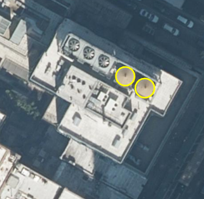

### NYC Planimetric Database

Looking for older capture rules? See the [2014 rules](https://github.com/CityOfNewYork/nyc-planimetrics/tree/planimetrics-2014)

#### Purpose
The purpose of this document is twofold. First, it is intended to define the capture rules for each planimetric feature collected as part of the planimetric update project. As such, this document is meant to clarify questions regarding how the features were captured, provide feature descriptions, and illustrate any exceptions that may apply. Second, since this document provides a wealth of information that would benefit users working with the data, we decided to make it accessible as a secondary source of documentation. This document is not intended to replace the metadata included with the planimetric features but rather to function as an additional source of information. Lastly, the documentation originated from previous planimetric updates. The documentation has evolved and has been refined over each successive planimetric update cycle; and will continue to be extended and maintained over the course of future updates.

#### Introduction
One of the core functions of the NYC Office of Technology and Innovation (OTI, formerly DoITT) GIS group is to maintain and distribute an accurate 'basemap' for NYC. Collectively, the basemap includes the digital orthophotography and planimetric features. The basemap provides the foundation upon which virtually all other geospatial data within New York government is registered. Ensuring its completeness and accuracy is fundamental to the Group’s core mission.

As part of a reorganization of New York City government agencies, The Department of Information Technology and Telecommunications (DoITT) was renamed as "Office of Technology & Innovation (OTI)". DoITT and OTI are equivalent terms for the same city agency.

#### Background
Planimetric mapping is the capture of geographic features from aerial survey (i.e., capture of aerial photography) that are traditionally mapped in two dimensions and are therefore exclusive of elevation. Quite simply these are the visible features that can be digitized from aerial photography. Often referred to as planimetric features or simply planimetics, these geographic features in their sum total essentially represent the base map data (i.e., layers) for a specific area.
NYC  first developed a planimetric database in 2000. The data was captured from the first ‘modern’ aerial survey of the New York City that took place in 1996. Referred to at that time as the NYC Landbase, components of this effort were the establishment of:

* a ‘database design’ (the delivery was ArcInfo coverages)
* coverage parameters (e.g., scale, projection, precision, fuzzy tolerance and dangle length)
* the specific features to be captured
* and a classification scheme (i.e., feature codes)

The delivery of the data was by 2,500′ x 2,500′ tiles, which directly corresponded to the orthophotography tiles.

#### Updates
A subsequent ad-hoc update to the planimetric database was done in 2004. This update was based on aerial surveys from 2001 (Manhattan and Staten Island) and 2002 (Bronx, Brooklyn and Queens). This update conformed to the previous database design. In 2006, DoITT formalized the update frequency of the planimetric database and aerial surveys. The aerial photography would be captured on a two-year cycle and the planimetrics a four-year cycle. The first regularly-scheduled planimetric update was based on the 2006 aerial photography and delieverd in 2008.

With each subsequent update, refinements have been made. New features and domains have been added, obsolete features have been removed, features have been captured in three dimensions, a seamless database has been produced and the time between aerial capture and delivery of the planimetrics has been shortened. For a complete list of the captures, see below.

#### Current Imagery
The source imagery for the current planimetric update was captured on the following dates:

* Manhattan - March 18, 2022
* Bronx - March 16, 2022
* Brooklyn - March 16 and 30, 2022
* Queens - March 16 and 30, 2022
* Staten Island – March 16, 2022

Using this orthoimagery, the planimetric base layers were updated city wide starting in November 2022 and were completed in October 2023

#### Previous Captures
|     |     |     |
| --- | --- | --- |
| **Planimetric Delivery** | **Year of Imagery** | **Download Link** |
| 2000 | 1996 | [download](https://data.cityofnewyork.us/Transportation/NYC-Planimetrics-Historic-2000-/xd8h-7j2h) |
| 2004 | 2001, 2002 | [download](https://data.cityofnewyork.us/Transportation/NYC-Planimetrics-Historic-2004-/49mj-4gmb) |
| 2008 | 2006 | [download](https://data.cityofnewyork.us/Transportation/NYC-Planimetrics-2008/dja4-zgtf) |
| 2012 | 2010 | [download](https://data.cityofnewyork.us/Transportation/NYC-Planimetrics-2012/3nr6-bnks) |
| 2016 | 2014 | [download](https://data.cityofnewyork.us/Transportation/NYC-Planimetrics/wt4d-p43d) |
| 2022 | 2022 | [download](https://data.cityofnewyork.us/Transportation/NYC-Planimetrics/wt4d-p43d) Update URL|

#### Table of Contents
* [Imagery and Data Specifications](#imagery-and-data-specifications)
* [General Attribute Information](#general-attribute-information)

**FEATURE CLASSES**

* [**Boardwalk**](#boardwalk)
* [**Cooling Towers**](#cooling-towers)
* [**Curb**](#curb)
* [**Curb Cut**](#curb-cut)
* [**Elevation**](#elevation)
* [**Hydro Structure**](#hydro-structure)
* [**Hydrography**](#hydrography)
* [**Median**](#median)
* [**Misc Structure Poly**](#misc-structure-poly)
* [**Open Space**](#open-space)
* [**Park**](#park)
* [**Parking Lot**](#parking-lot)
* [**Pavement Edge**](#pavement-edge)
* [**Pavementedge Carto**](#pavementedge-carto)
* [**Plaza**](#plaza)
* [**Railroad**](#railroad)
* [**Railroad Structure**](#railroad-structure)
* [**Retainingwall**](#retainingwall)
* [**Roadbed**](#roadbed)
* [**Shoreline**](#shoreline)
* [**Sidewalk**](#sidewalk)
* [**Sidewalk Line**](#sidewalk-line)
* [**Swimming Pool**](#swimming-pool)
* [**Transport Structure**](#transport-structure)
* [**Under Construction Unknown**](#under-construction-unknown)
* [**Water Tank**](#water-tank)

# Imagery and Data Specifications
Digital planimetrics were derived using the imagery products delivered with the 2022 New York Statewide Flyover (see Introduction for specific flight dates), which includes raw imagery collected to support the generation of 0.5 Ft Ground Sample Distance (GSD) natural color imagery. The images were captured with 80% forward lap and side lap to support 1”=100’ mapping and meet the distortion free requirements within New York City. Planimetrics are developed to meet American Society for Photogrammetry and Remote Sensing (ASPRS) Class 1 (one) horizontal mapping standards and ASPRS vertical Class 2 (two) accuracy specifications. 

Planimetrics are delivered via an ESRI geodatabase in New York State Plane Coordinates, Long Island East Zone, NAD83, US foot. The vertical datum for all features is NAVD88.  

For more information on the coordinate reference system used, see the following EPSG definition pages:
[Planimetrics](https://epsg.io/2263)
[Orthoimagery](https://epsg.io/6539)

# General Attribute Information

The following attribute information applies to all feature classes.  Additional attributes specific to a given feature class are listed within the details for that feature class. 

NYC Office of Technology and Innovation publishes multiple file formats of the planimetric data where different formats might have abbreviated attributes due to file format restraints.  Where applicable, these abbreviated attributes are provided below in parentheses.

|     |     |
| --- | --- |
| **Attribute** | **Description** |
| **SOURCE_ID** | Unique feature Identification Number. |
| **FEATURE_CODE (FEAT_CODE)** | Indicates the type of feature.  |
| **SUB_FEATURE_CODE (SUB_CODE)** | (where applicable) indicates a subset of features within a given “Feature_Code” set.  |
| **STATUS** | Field indicating the feature status as it fits into one of the following categories: a) Newly collected in 2022 - feature captured for the first time during the 2022 planimetrics update project. b) Feature has changed in 2022 collection - feature existed previously but has been updated during the 2022 planimetrics update project. c) No change in 2022 collection - feature is unchanged from the source planimetrics database. |

[Back to Table of Contents](#table-of-contents)

# BOARDWALK

**Geometry Type:** Polygon

|     |     |
| --- | --- |
| **Sources** | Current imagery - see intro for specific dates.  Previous planimetric database  |
| **Features Captured** | Boardwalks along beachfront. |
| **Capture Notes** | Edge of boardwalks along beachfront.  Maintain beach outline/shoreline (do not adjust for tidal differences between imagery flyover dates). |
| **Features Excluded** | n/a |
| **Feature View** |  |

[Back to Table of Contents](#table-of-contents)

# COOLING TOWERS

**Geometry Type:** Polygon

|     |     |
| --- | --- |
| **Sources** | Current imagery - see intro for specific dates. |
| **Features Captured** | Cooling Towers typically found on the roofs of large buildings that enclose large fans used for ventilation and cooling. |
| **Capture Notes** | Only cooling towers greater than four (4) ft in diameter were captured. |
| **Features Excluded** | n/a |
| **Feature View** |  |

[Back to Table of Contents](#table-of-contents)

#### COOLING TOWERS Attributes

|     |     |
| --- | --- |
| **Attribute** | **Description** |
| **SUB_FEATURE_CODE (SUB_CODE)** | Field that indicates where the structure is located:: a) Roof level -  located on the building roof b) Ground level - located on the ground at street grade level |
| **BIN** | Building Information Number of the structure the cooling tower is located on. Obtain from building footprints polygon feature that contains the cooling tower shape |

[Back to Table of Contents](#table-of-contents)

# CURB

**Geometry Type:** Polyline

|     |     |
| --- | --- |
| **Sources** | Current imagery - see intro for specific dates.  Previous planimetric database |
| **Features Captured** | All curbs between roadbed pavement and other surfaces (i.e., within the street right-of-way) were captured. |
| **Capture Notes** | This was a new feature class in the 2016 collection.  Prior to the 2016 capture, Curbs were a subset of the Pavement Edge feature class but were broken out into a seperate feature class in 2016. |
| **Features Excluded** | n/a |
| **Feature View** |  |

[Back to Table of Contents](#table-of-contents)

# CURB CUT

**Geometry Type:** Polyline

|     |     |
| --- | --- |
| **Sources** | Current imagery - see intro for specific dates. New capture. |
| **Features Captured** | An opening in the curb created to allow a driveway or a right of way to enter from the roadbed. Captured in alignment with the Curb feature class. |
| **Capture Notes** | This was a new feature class in the 2022 collection. |
| **Features Excluded** | n/a |
| **Feature View** |    Examples of MIDBLOCK_CURBCUT (yellow arrows) and CORNER_CURBCUT (red arrows) |

[Back to Table of Contents](#table-of-contents)

#### CURB CUT Attributes

|     |     |
| --- | --- |
| **Attribute** | **Description** |
| **SUB_FEATURE_CODE (SUB_CODE)** | Field that indicates feature type: a) MIDBLOCK_CURBCUT -  Break CURB features at extents of curbcuts located along block edges b) CORNER_CURBCUT - Break CURB features at extents of curbcuts located along block corners or street intersections |

[Back to Table of Contents](#table-of-contents)

# ELEVATION

**Geometry Type:** Point

|     |     |
| --- | --- |
| **Subtype** | **Feature Code** |
| **[Building Elevation](#subtype-building-elevation)** | 3020 |
| **[Water Elevation](#subtype-water-elevation)** | 3010 |
| **[Spot Elevation](#subtype-spot-elevation)** | 300000 |
| **[Bridge Elevation](#subtype-bridge-elevation)** | 300020 |

[**Attributes**](#elevation-attributes)

[**Diagrams**](#elevation-diagrams)

*Note: The vertical accuracy was set to the following standard:  ASPRS 1”=100’ Class 2.*

### Subtype: BUILDING ELEVATION

|     |     |
| --- | --- |
| **Sources** | Current imagery - see intro for specific dates.  Previous planimetric database  |
| **Features Captured** | Elevation points were captured for all building footprint features. |
| **Capture Notes** | Elevation of the highest portion of the roof of a building, excluding antennas and roof fixtures such as air conditioning (AC), elevator shafts, chimneys, etc. 
 Elevation values were transferred to each building footprint to calculate the building height attribute. |
| **Features Excluded** | n/a |
| **Feature View** |  |

[Back to Table of Contents](#table-of-contents)

### Subtype: WATER ELEVATION

|     |     |
| --- | --- |
| **Sources** | Current imagery - see intro for specific dates.  Previous planimetric database  |
| **Features Captured** | Elevation points were captured on standing water (ponds, reservoirs, lakes). |
| **Capture Notes** | n/a |
| **Features Excluded** | n/a |
| **Feature View** |  |

[Back to Table of Contents](#table-of-contents)

### Subtype: SPOT ELEVATION

|     |     |
| --- | --- |
| **Sources** | Current imagery - see intro for specific dates.  Previous planimetric database  |
| **Features Captured** | Spot elevations were captured on paved, unpaved, and alley subtypes in <a href="https://data.ny.gov/City-Government/NYC-Street-Centerline-CSCL-/exjm-f27b/about">CSCL</a> centerline and all <a href="https://data.cityofnewyork.us/dataset/Sidewalk-Centerline/a9xv-vek9/about">Interior Sideswalk CSCL</a> feature classes.  Elevation points were placed in the center of the roadbed (coincident with CSCL features).  These points were captured at the beginning, middle, and end of length of visible roadbed.  Additional elevation points were added at 200’ spacing when the distance between the beginning, middle, or end was greater than 200 linear feet. |
| **Capture Notes** | In areas where the [PAVEMENT_EDGE](#pavement_edge) feature class has been updated, any existing Spot elevations were updated.For new streets, new spot elevations were created in the center of the roadbed according to the following rules: 1) Placed at Intersections (might not necessarily be at the same location as the node from the centerline, one point per intersection even on complex intersections). 2) Placed Every 200 feet when midpoint of bridge or city block exceeds distance. 3) Placed on paved, unpaved, alley subtypes in <a href="https://data.ny.gov/City-Government/NYC-Street-Centerline-CSCL-/exjm-f27b/about">CSCL</a> centerline features class and all of the Interior Sidewalk Centerline feature class.  Spot elevation were not added to a CSCL feature if no roadbed exists (e,g, area is under construction). 4) Mid-Street segment – at the approximate mid-point of a street segment. |
| **Features Excluded** | Spot elevations were not captured on a <a href="https://data.ny.gov/City-Government/NYC-Street-Centerline-CSCL-/exjm-f27b/about">CSCL</a> feature if no roadbed exists. |
| **Feature View** |  |

[Back to Table of Contents](#table-of-contents)

### Subtype: BRIDGE ELEVATION

|     |     |
| --- | --- |
| **Sources** | Current imagery - see intro for specific dates.  Previous planimetric database  |
| **Features Captured** | n/a |
| **Capture Notes** | This is a subset of spot elevations.  These points were captured at the beginning, middle, and end of length of visible bridges and overpasses.  Additional elevation points were added at 200’ spacing when the distance between the beginning, middle, or end was greater than 200 linear feet. |
| **Features Excluded** | Elevation points were not collected for pedestrian/bike bridges. |
| **Feature View** |  |

[Back to Table of Contents](#table-of-contents)

#### Elevation Attributes

|     |     |
| --- | --- |
| **Attribute** | **Description** |
| **Elevation** | Field measuring surface elevation above sea level (in feet). |

[Back to Table of Contents](#table-of-contents)

#### Elevation Diagrams

[Back to Table of Contents](#table-of-contents)

# HYDRO STRUCTURE

**NYC Open Data Name:** Hydrography Structures

**Geometry Type:** Polygon

|     |     |
| --- | --- |
| **Subtype** | **Feature Code** |
| **[Piers](#subtype-piers)** | 2800 |
| **[Jetty](#subtype-jetty)** | 2810 |
| **[Seawall](#subtype-seawall)** | 2820 |

[**Attributes**](#hydro-structure-attributes)

### Subtype: PIERS

|     |     |
| --- | --- |
| **Sources** | Current imagery - see intro for specific dates.  Previous planimetric database  |
| **Features Captured** | Decks supported by posts extending into the water. |
| **Capture Notes** | Updated piers, commercial piers, and docks. Used existing planimetrics data as guide. |
| **Features Excluded** | Individual/private docks for recreational watercraft were not captured, unless they had already been captured as such in existing planimetric data. |
| **Feature View** |  |

[Back to Table of Contents](#table-of-contents)

### Subtype: JETTY

|     |     |
| --- | --- |
| **Sources** | Current imagery - see intro for specific dates.  Previous planimetric database  |
| **Features Captured** | Structures, usually comprised of stone, earth, or concrete; extending from shore to lessen erosion.  They are often installed in continuation of river channels at their outlets or into docks, and outside their entrances. |
| **Capture Notes** | Delineated at the water level. |
| **Features Excluded** | n/a |
| **Feature View** |  |

[Back to Table of Contents](#table-of-contents)

### Subtype: SEAWALL

|     |     |
| --- | --- |
| **Sources** | Current imagery - see intro for specific dates.  Previous planimetric database  |
| **Features Captured** | Seawalls are typically built on the land parallel to the coast, but may also include breakwaters that are built into the water. |
| **Capture Notes** | n/a |
| **Features Excluded** | n/a |
| **Feature View** |  |

[Back to Table of Contents](#table-of-contents)

#### Hydro Structure Attributes

|     |     |
| --- | --- |
| **Attribute** | **Description** |
| **Elevation** | Field measuring surface elevation above sea level (in feet). |

[Back to Table of Contents](#table-of-contents)

# HYDROGRAPHY

**Geometry Type:** Polygon

|     |     |
| --- | --- |
| **Subtype** | **Feature Code** |
| **[Lake/Reservoir](#subtype-lakereservoir)** | 2600 |
| **[Pond](#subtype-pond)** | 2610 |
| **[River](#subtype-river)** | 2620 |
| **[Stream](#subtype-stream)** | 2630 |
| **[Wetland/Marsh](#subtype-wetlandmarsh)** | 2640 |
| **[Beach/Shoreline](#subtype-beachshoreline)** | 2650 |
| **[Bay/Ocean](#subtype-bayocean)** | 2660 |

[**Attributes**](#hydrography-attributes)

### Subtype: LAKE/RESERVOIR

|     |     |
| --- | --- |
| **Sources** | Current imagery - see intro for specific dates.  Previous planimetric database  |
| **Features Captured** | n/a |
| **Capture Notes** | Updated all Lake/Reservoirs when general shape had changed. Existing features were not updated due to different water level. |
| **Features Excluded** | n/a |
| **Feature View** |  |

[Back to Table of Contents](#table-of-contents)

### Subtype: POND

|     |     |
| --- | --- |
| **Sources** | Current imagery - see intro for specific dates.  Previous planimetric database  |
| **Features Captured** | n/a |
| **Capture Notes** | Updated pond outline when general shape had changed. Existing features were not updated due to different water level. |
| **Features Excluded** | n/a |
| **Feature View** |  |

[Back to Table of Contents](#table-of-contents)

### Subtype: RIVER

|     |     |
| --- | --- |
| **Sources** | Current imagery - see intro for specific dates.  Previous planimetric database  |
| **Features Captured** | n/a |
| **Capture Notes** | Updated all river edges whenever new conditions were encountered (e.g., due to piers, etc.).  Maintained internal divisions of river due to name change(s).  Existing hydrographic centerlines were used as reference but were not updated. |
| **Features Excluded** | n/a |
| **Feature View** |  |

[Back to Table of Contents](#table-of-contents)

### Subtype: STREAM

|     |     |
| --- | --- |
| **Sources** | Current imagery - see intro for specific dates.  Previous planimetric database  |
| **Features Captured** | n/a |
| **Capture Notes** | Updated all streams found to be wider than eight (8) feet if bank had changed.  Maintained internal divisions of stream due to name change(s). |
| **Features Excluded** | n/a |
| **Feature View** |  |

[Back to Table of Contents](#table-of-contents)

### Subtype: WETLAND/MARSH

|     |     |
| --- | --- |
| **Sources** | Current imagery - see intro for specific dates.  Previous planimetric database  |
| **Features Captured** | n/a |
| **Capture Notes** | Update wetland and marsh boundaries only when changed due to drainage, change in surface, or if covered by buildings. |
| **Features Excluded** | n/a |
| **Feature View** |  |

[Back to Table of Contents](#table-of-contents)

### Subtype: BEACH/SHORELINE

|     |     |
| --- | --- |
| **Sources** | Current imagery - see intro for specific dates.  Previous planimetric database  |
| **Features Captured** | n/a |
| **Capture Notes** | Updated beach and shoreline whenever feature had changed due to construction or erosion.  DoITT designation in existing files was maintained. Maintained interior divisions.  Did not update due to different water level (high/low tide). |
| **Features Excluded** | n/a |
| **Feature View** |  |

[Back to Table of Contents](#table-of-contents)

### Subtype: BAY/OCEAN

|     |     |
| --- | --- |
| **Sources** | Current imagery - see intro for specific dates.  Previous planimetric database  |
| **Features Captured** | n/a |
| **Capture Notes** | Updated bay/ocean shoreline whenever feature had changed due to construction or erosion.  DoITT designation in existing files was maintained. Maintained interior divisions.  Did not update due to different water level (high/low tide). |
| **Features Excluded** | n/a |
| **Feature View** |  |

[Back to Table of Contents](#table-of-contents)

#### Hydrography Attributes

|     |     |
| --- | --- |
| **Attribute** | **Description** |
| **NAME** | Name of Waterbody or Watercourse. |

[Back to Table of Contents](#table-of-contents)

# MEDIAN

**Geometry Type:** Polygon

|     |     |
| --- | --- |
| **Subtype** | **Feature Code** |
| **[Median_Traffic Island](#subtype-median_traffic-island)** | 360080 |
| **[Median_Painted](#subtype-median_painted)** | 360010 |
| **[Median_Curb](#subtype-median_curb)** | 360020 |
| **[Median_Rail](#subtype-median_rail)** | 360030 |
| **[Median_Fence](#subtype-median_fence)** | 360040 |
| **[Median_Grass](#subtype-median_grass)** | 360050 |
| **[Median_Barrier](#subtype-median_barrier)** | 360060 |
| **[Median_Other](#subtype-median_other)** | 360070 |

*Rule: Medians were not intersected by <a href="https://data.ny.gov/City-Government/NYC-Street-Centerline-CSCL-/exjm-f27b/about">CSCL</a> on the same road except in some rare occasions (e.g. at street intersections with medians). Median type hierarchy is as follows: barrier, rail, fence, curb, grass and painted.*

### General Guidelines for Medians

|     |     |
| --- | --- |
| **Sources** | Current imagery - see intro for specific dates.  Previous planimetric database  |
| **Features Captured** | All medians that physically divide a roadbed were collected; which includes medians, traffic islands, "Jersey Barriers", and painted areas that are used to separate traffic flow. |
| **Capture Notes** | Medians are sometimes paved, are normally elevated (have a curb), or have dirt or grass. Medians can have sidewalks crossing them. In those cases, the outline of the largest area was incorporated into a single median feature. The NYC online <a href="https://data.cityofnewyork.us/Transportation/Bike-Routes/umu5-zyd3">Bike Routes</a> data was used as a reference to identify potential new medians. Areas where the column ALLCLASSES is equal to I and "I,II" most often contained new medians. New Medians exist throughout the City regardless of these bike lane classifications. Thus, this was considered a supplemental source only. |
| **Features Excluded** | The following features were not captured as medians: • Barriers in front of buildings • Jersey Barriers used to regulate traffic in construction areas, or • Jersey Barriers used to block-off road access. |

[Back to Table of Contents](#table-of-contents)

### Subtype: MEDIAN_TRAFFIC ISLAND

|     |     |
| --- | --- |
| **Sources** | Current imagery - see intro for specific dates.  Previous planimetric database  |
| **Features Captured** | Medians occuring at an intersection |
| **Capture Notes** | n/a |
| **Features Excluded** | n/a |
| **Feature View** |  |

[Back to Table of Contents](#table-of-contents)

### Subtype: MEDIAN_PAINTED

|     |     |
| --- | --- |
| **Sources** | Current imagery - see intro for specific dates.  Previous planimetric database  |
| **Features Captured** | Medians having white paved marking (fishbone or striped pattern). |
| **Capture Notes** | n/a |
| **Features Excluded** | Double yellow lines in the middle of a road were not captured as median.Single independent white medians hatching used to direct traffic were not captured as median. |
| **Feature View** |  |

[Back to Table of Contents](#table-of-contents)

### Subtype: MEDIAN_CURB

|     |     |
| --- | --- |
| **Sources** | Current imagery - see intro for specific dates.  Previous planimetric database  |
| **Features Captured** | Medians with curb edging, regardless of interior content (grass, pavement, concrete, etc.). |
| **Capture Notes** | n/a |
| **Features Excluded** | n/a |
| **Feature View** |  |

[Back to Table of Contents](#table-of-contents)

### Subtype: MEDIAN_RAIL

|     |     |
| --- | --- |
| **Sources** | Current imagery - see intro for specific dates.  Previous planimetric database  |
| **Features Captured** | Medians with guardrail outlining the curb of the median.  |
| **Capture Notes** | These features incorporate a fixed width of three (3) feet centered on the fence. |
| **Features Excluded** | n/a |
| **Feature View** |  |

[Back to Table of Contents](#table-of-contents)

### Subtype: MEDIAN_FENCE

|     |     |
| --- | --- |
| **Sources** | Current imagery - see intro for specific dates.  Previous planimetric database  |
| **Features Captured** | Medians with fencing.   |
| **Capture Notes** | n/a |
| **Features Excluded** | If feature represents a Jersey Barrier with fencing, the feature was collected as a Jersey barrier. |
| **Feature View** |  |

[Back to Table of Contents](#table-of-contents)

### Subtype: MEDIAN_GRASS

|     |     |
| --- | --- |
| **Sources** | Current imagery - see intro for specific dates.  Previous planimetric database  |
| **Features Captured** | Medians with grass/vegetation inside and no curb. |
| **Capture Notes** | n/a |
| **Features Excluded** | n/a |
| **Feature View** |  |

[Back to Table of Contents](#table-of-contents)

### Subtype: MEDIAN_BARRIER

|     |     |
| --- | --- |
| **Sources** | Current imagery - see intro for specific dates.  Previous planimetric database  |
| **Features Captured** | "Jersey barriers" of a “permanent nature” (i.e., in place to regulate the traffic, positioned at a constant width of three (3) feet centered on the barrier).  |
| **Capture Notes** | Whenever two jersey barriers were placed next to or in short distance of each other, the outer-most edge of both were used to determine the outline of a single feature. |
| **Features Excluded** | Barrier medians which are moved on a daily basis, (e.g., at Manhattan entrances to Lincoln Tunnel) were not captured. |
| **Feature View** |  |

[Back to Table of Contents](#table-of-contents)

### Subtype: MEDIAN_OTHER

|     |     |
| --- | --- |
| **Sources** | Current imagery - see intro for specific dates.  Previous planimetric database  |
| **Features Captured** | Other medians |
| **Capture Notes** | n/a |
| **Features Excluded** | n/a |
| **Feature View** |  |

[Back to Table of Contents](#table-of-contents)

#### Median Attributes

|     |     |
| --- | --- |
| **Attribute** | **Description** |
| **STREET NAME (STREET_NAM)** | Name of adjacent street. |

[Back to Table of Contents](#table-of-contents)

# MISC STRUCTURE POLY

**Geometry Type:** Polygon

|     |     |
| --- | --- |
| **Subtype** | **Feature Code** |
| **[Large Billboard and Signs](#subtype-large-billboard-and-signs)** | 4100 |
| **[Sign Gantry](#subtype-sign-gantry)** | 4110 |
| **[Toll Area](#subtype-toll-area)** | 4200 |

[**Attributes**](#misc-structure-poly-attributes)

### Subtype: LARGE BILLBOARD AND SIGNS

|     |     |
| --- | --- |
| **Sources** | Current imagery - see intro for specific dates.  Previous planimetric database  |
| **Features Captured** | All billboards (including those found on rooftops), with three (3) foot standard width. |
| **Capture Notes** | These features are represented with multiple shapes (triangle, V- shaped, etc.). |
| **Features Excluded** | Support structures were not included as part of these features. |
| **Feature View** |  |

[Back to Table of Contents](#table-of-contents)

### Subtype: SIGN GANTRY

|     |     |
| --- | --- |
| **Sources** | Current imagery - see intro for specific dates.  Previous planimetric database  |
| **Features Captured** | Traffic information strutures that cross traffic lanes. |
| **Capture Notes** | These features were digitized end-to-end, with seven (7) foot standard width. |
| **Features Excluded** | n/a |
| **Feature View** |  |

[Back to Table of Contents](#table-of-contents)

### Subtype: TOLL AREA

|     |     |
| --- | --- |
| **Sources** | Current imagery - see intro for specific dates.  Previous planimetric database  |
| **Features Captured** | Roof outline of toll plaza buildings (tool booths), regardless of size. |
| **Capture Notes** | n/a |
| **Features Excluded** | n/a |
| **Feature View** |  |

[Back to Table of Contents](#table-of-contents)

#### Misc Structure Poly Attributes

|     |     |
| --- | --- |
| **Attribute** | **Description** |
| **DESCRIPTION (DESCRIPTIO)** | Field characterizing the miscellaneous structure. |

[Back to Table of Contents](#table-of-contents)

# OPEN SPACE

**NYC Open Data Name:** Open Space Other

**Geometry Type:** Polygon

|     |     |
| --- | --- |
| **Subtype** | **Feature Code** |
| **[Cemetery Outline](#subtype-cemetery-outline)** | 2500 |
| **[Recreational Area](#subtype-recreational-area)** | 2510 |
| **[Vacant Area](#subtype-vacant-area)** | 2520 |

[**Attributes**](#open-space-attributes)

### Subtype: CEMETERY OUTLINE

|     |     |
| --- | --- |
| **Sources** | Current imagery - see intro for specific dates.  Previous planimetric database  |
| **Features Captured** | Updated cemetery boundaries from new imagery. |
| **Capture Notes** | Individual headstones, graves, or interior boundaries were not partitioned. |
| **Features Excluded** | n/a |
| **Feature View** |  |

[Back to Table of Contents](#table-of-contents)

### Subtype: RECREATIONAL AREA

|     |     |
| --- | --- |
| **Sources** | Current imagery - see intro for specific dates.  Previous planimetric database  |
| **Features Captured** | Outline of recreational areas which may be used for picnic or other recreational activities. Recreational areas must contain at least one of the following: a) Benches, b) Swings, or c) Play area. Hardscape recreational areas were collected differently than softscape recreational areas, as follows:   • Hardscape recreational areas have either hard surfaces or sand. These areas were captured as discrete polygons following the edges of these areas precisely.   • Softscape recreational areas are grassy areas for football/baseball/other. These areas were captured as a single polygon (i.e., not discrete polygons) and snapped to other features (e.g. sidewalks, roadbed, hydro, etc.) where applicable.   • When hardscapes and softscapes exists adjacent to one another, the entire area was captured by a single polygon. |
| **Capture Notes** | These features are entirely outside of NYC designated parks. |
| **Features Excluded** | Medians with either benches, swings, or play areas were captured as a median and not a recreational area. |
| **Feature Views** | 
This screenshot represents a hardscape recreational area.

This screenshot represents a softscape recreational area.

This screenshot represents a combined hardscape / softscape recreational area.
 |

[Back to Table of Contents](#table-of-contents)

### Subtype: VACANT AREA

|     |     |
| --- | --- |
| **Sources** | Current imagery - see intro for specific dates.  Previous planimetric database DOF Digital Tax Map |
| **Features Captured** | These features represent a vacant lot where a building could potentially be built and is associated with a tax lot polygon. |
| **Capture Notes** | "Vacant" is defined herein as an area containing no structures. The Digital Tax Map (DTM) and currently captured planimetrics ([Building Footprints](#building-footprints)) were used to determine the location of the vacant areas. The actual shape of each vacant aras was captured using physical features that typically form the boundary of a property such as fences, hedgerow, etc. Vacant Areas extend to sidewalk or roadbed edge. As a general rule of thumb, vacant lots were required to have roadway frontage, and not actively used for private or public entities (e.g., backyard or commmunity garden). |
| **Features Excluded** | n/a |
| **Feature View** |  |

[Back to Table of Contents](#table-of-contents)

#### Open Space Attributes

|     |     |
| --- | --- |
| **Attribute** | **Description** |
| **NAME** | Name of Open Space Area. |

[Back to Table of Contents](#table-of-contents)

# PARK

**NYC Open Data Name:** Open Space (Parks)

**Geometry Type:** Polygon

|     |     |
| --- | --- |
| **Subtype** | **Feature Code** |
| **[Park Boundary](#subtype-park-boundary)** | 4980 |
| **[Baseball/Softball Field](#subtype-baseballsoftball-field)** | 4900 |
| **[Court](#subtype-court)** | 491000 |
| **[Court, Basketball](#subtype-court)** | 491010 |
| **[Court, Handball](#subtype-court)** | 491030 |
| **[Court, Hockey](#subtype-court)** | 491040 |
| **[Court, Multipurpose](#subtype-court)** | 491050 |
| **[Court, Tennis](#subtype-court)** | 491060 |
| **[Court, Volleyball](#subtype-court)** | 491070 |
| **[Football Field](#subtype-football-field)** | 4920 |
| **[Soccer Field](#subtype-soccer-field)** | 4930 |
| **[Golf Course](#subtype-golf-course)** | 4940 |
| **[Pool](#subtype-pool)** | 4950 |
| **[Running Track](#subtype-running-track)** | 4960 |
| **[Skating Rink](#subtype-skating-rink)** | 4970 |
| **[Greenstreets](#subtype-greenstreets)** | 4985 |

[**Attributes**](#park-attributes)

### Subtype: PARK BOUNDARY

|     |     |
| --- | --- |
| **Sources** | Current imagery - see intro for specific dates.  Previous planimetric database  Department of Parks and Recreation (DPR) Parks Properties |
| **Features Captured** | Outline the outer perimeter of any park from <a href="https://data.cityofnewyork.us/City-Government/Parks-Properties/rjaj-zgq7/about">DPR Parks Properties</a>. The boundary encompasses the entire park as a single polygon feature, regardless of special features such as baseball diamonds or tennis courts. The delineation of the outer edge of each park boundary is coincident with the “intended” boundary feature, as determined by the Parks Department. Intended boundary feature are curbs, green areas, sidewalks, etc. and vary from park to park.  At times, the intended boundary feature varies within the same park.  |
| **Capture Notes** | When the source data had a single boundary polygon extending across other planimetric features (e.g. roads), the planimetric park boundary follows the source data. When there was no apparent physical boundary feature to delineate the Park boundary, the feature was copied “as is” from the source database. Park names (SIGNNAME and source column) and park numbers (GISPROPNUM source column) were transferred from source databases to park boundaries and special features. Interior road systems and special features within parks were not partitioned. |
| **Features Excluded** | n/a |
| **Feature View** |  |

[Back to Table of Contents](#table-of-contents)

### Subtype: BASEBALL/SOFTBALL FIELD

|     |     |
| --- | --- |
| **Sources** | Current imagery - see intro for specific dates.  Previous planimetric database DPR Parks Properties |
| **Features Captured** | Outline of the sandy area (diamond) in softball/baseball fields. |
| **Capture Notes** |  These features can have different sizes and can be also be represented as painted areas on hard surfaces. These features extend back to the backstop of the field and include the 1st and 3rd base coaching boxes. |
| **Features Excluded** | n/a |
| **Feature View** |  |

[Back to Table of Contents](#table-of-contents)

### Subtype: COURT

|     |     |
| --- | --- |
| **Sources** | Current imagery - see intro for specific dates.  Previous planimetric database DPR Parks Properties |
| **Features Captured** | Outline of individual courts. |
| **Capture Notes** |  Varoius kinds of courts are captured within Court : a) Basketball courts- These features can be represented as full or half courts.  b) Handball courts - The hard surface wall was incorporated witin each court. When multiple courts are adjacent to one another, a division line was digitized to partition individual courts. c) Hockey - Outline of hockey court.   d) Multipurpose courts - These features are composed of mostly hard surface areas with different markings for different activities. e) Tennis court - Outline of tennis courts (hard surface only).In cases of multiple courts, a division line was digitized along outer painted line (baseline and sideline) to partition individual courts. The extent of these features only includes "in-bounds areas", they do not extend to the fence surrounding the tennis court area (or related "out-of-bounds areas"). f) Volleyball - Outline of volleyball courts using distinct markings on observed hard surface.|
| **Features Excluded** | Tennis courts - Individual tennis courts within NYC Parks were not captured. Private tennis courts (e.g., on roofs or hotels, etc.) were not captured. |
| **Feature View** |   Basketball court     Handball court      Hockey     Multipurpose court      Tennis Court      Volleyball court|

[Back to Table of Contents](#table-of-contents)

### Subtype: FOOTBALL FIELD

|     |     |
| --- | --- |
| **Sources** | Current imagery - see intro for specific dates.  Previous planimetric database DPR Parks Properties |
| **Features Captured** | Outline of football fields.The extent of these features only includes "in-bounds areas", they do not extend to the turf surrounding the playing field (or related "out-of-bounds areas"). |
| **Capture Notes** | n/a |
| **Features Excluded** | n/a |
| **Feature View** |  |

[Back to Table of Contents](#table-of-contents)

### Subtype: SOCCER FIELD

|     |     |
| --- | --- |
| **Sources** | Current imagery - see intro for specific dates.  Previous planimetric database DPR Parks Properties |
| **Features Captured** | Outline of soccer fields. |
| **Capture Notes** |  Outline is represent by extent of grassy surface. |
| **Features Excluded** | n/a |
| **Feature View** |  |

[Back to Table of Contents](#table-of-contents)

### Subtype: GOLF COURSE

|     |     |
| --- | --- |
| **Sources** | Current imagery - see intro for specific dates.  Previous planimetric database DPR Parks Properties |
| **Features Captured** | Outline of golf courses along fence or other man-made boundary. |
| **Capture Notes** | n/a |
| **Features Excluded** | The outline of greens, tees, fairways, sand traps, shelters, or cart paths were not captured. |
| **Feature View** |  |

[Back to Table of Contents](#table-of-contents)

### Subtype: POOL

|     |     |
| --- | --- |
| **Sources** | Current imagery - see intro for specific dates.  Previous planimetric database DPR Parks Properties |
| **Features Captured** | Outline of public pool areas. |
| **Capture Notes** | n/a |
| **Features Excluded** | n/a |
| **Feature View** |  |

[Back to Table of Contents](#table-of-contents)

### Subtype: RUNNING TRACK

|     |     |
| --- | --- |
| **Sources** | Current imagery - see intro for specific dates.  Previous planimetric database DPR Parks Properties |
| **Features Captured** | Outline of running tracks, typically around grassy sport fields. |
| **Capture Notes** | n/a |
| **Features Excluded** | Tracks painted upon concrete surfaces were not captured. |
| **Feature View** |  |

[Back to Table of Contents](#table-of-contents)

### Subtype: SKATING RINK

|     |     |
| --- | --- |
| **Sources** | Current imagery - see intro for specific dates.  Previous planimetric database DPR Parks Properties |
| **Features Captured** | Outline of skating/hockey rinks using distinct markings on observed hard surface. |
| **Capture Notes** | n/a |
| **Features Excluded** | n/a |
| **Feature View** |  |

[Back to Table of Contents](#table-of-contents)

### Subtype: GREENSTREETS

|     |     |
| --- | --- |
| **Sources** | Current imagery - see intro for specific dates.  Previous planimetric database DPR Parks Properties |
| **Features Captured** | Using <a href="https://data.cityofnewyork.us/Environment/Greenstreets/p23h-ci72">DPR Greenstreets</a> as the definitive source, these areas were updated and attributed using the source data. Name was populated from the SITENAME source column and park numbers were populated from the GISPROPNUM source column. |
| **Capture Notes** | All the rules for defining park boundaries were applied for defining Greenstreet limits. |
| **Features Excluded** | n/a |
| **Feature View** |  |

[Back to Table of Contents](#table-of-contents)

#### Park Attributes

|     |     |
| --- | --- |
| **Attribute** | **Description** |
| **PARK_NAME** | Name of Park |
| **LANDUSE** | Not edited in planimetrics. Carried over from source NYC Dept of Parks and Recreation data. |
| **PARKNUM** | Unique park identification number corresponding with PARK_NAME. |
| **SYSTEM** | Not edited in planimetrics. Carried over from source NYC Dept of Parks and Recreation data. |

[Back to Table of Contents](#table-of-contents)

# PARKING LOT

**Geometry Type:** Polygon

*Note: Parking lot outlines were often interected by sidewalks, but only at the entrance and exit.*

|     |     |
| --- | --- |
| **Sources** | Current imagery - see intro for specific dates.  Previous planimetric database  |
| **Features Captured** | All parking lots (paved or unpaved) greater than 2,000 sq. feet. Parking areas adjacent to the travel-way and separated from the travel-way by a curb or other obstruction were captured as parking lots. In these cases, the [Roadbed](#roadbed) and [Pavement Edge](#pavement-edge) end or wrap around the parking lot. The parking lot is not included as part of the Roadbed. |
| **Capture Notes** | These features connect to road edge ([Curb](#curb) or [Road Edge](#subtype-road-edge)) only at entrances and exits. |
| **Features Excluded** | Traffic islands within parking lot were not captured.When a building of > 400 sq. feet was present, the building area was excluded from the parking lot polygon. Parking areas adjacent to the travel-way, but not separated from the travel-way by a curb or other obstruction, were not captured. Instead, those parking areas were included as part of the Roadbed and the Pavement Edge extends to the outside edge of such area. Gas stations, private parking areas (e.g., for condos), and storage areas (e.g., for boats) were not captured.  |
| **Feature View** |  |

[Back to Table of Contents](#table-of-contents)

# PAVEMENT EDGE

**Geometry Type:** Polyline

|     |     |
| --- | --- |
| **Subtype** | **Feature Code** |
| **[Road Edge](#subtype-road-edge)** | 2260 |
| **[Airport Runway](#subtype-airport-runway)** | 2230 |
| **[Alley](#subtype-alley)** | 2270 |

[**Attributes**](#pavement-edge-attributes)

[**Diagrams**](#pavement-edge-diagrams)

### Subtype: ROAD EDGE

|     |     |
| --- | --- |
| **Sources** | Current imagery - see intro for specific dates.  Previous planimetric database  |
| **Features Captured** | Updated all segments between pavement and other surfaces or features (i.e. Curbs, sidewalks, or grass).  |
| **Capture Notes** | Each segment was captured as a continuous feature across a blockface (typically from one intersection to the next – along that side of the road). The vertex between two segments was often located at the street corner. Edge of Pavement features are continuous across driveways, alleys, or access to parking. The one exception to this rule is where a street segment changes names (as determined by <a href="https://data.ny.gov/City-Government/NYC-Street-Centerline-CSCL-/exjm-f27b/about">CSCL</a> Centerline names) outside of any street intersections.  In these cases, the existing CSCL break (node) was used to create corresponding breaks in Pavement Edge segments.For cul-de-sacs, two segments were created. The CSCL centerline was used to define the breakpoints of the Pavement Edge segments.Dead end streets were terminatde where the tax map crosses the road.  Two segments were created on left and right sides of CSCL.On highways, Pavement Edge corresponds to the ‘roadbed’ sub-feature class in [Roadbed](#roadbed), and does not include the shoulder. |
| **Features Excluded** | n/a |
| **Feature Views** | 
This screenshot represents pavement edges at a large intersection.

In a cul-de-sac, two segments would be required for the edge of pavement. One on either side of the roadbed assigned a left or right side based on the CSCL.

Example of a 'T' intersection, one segment would be captured for edge at the top of 'T'.

For roadbeds whose street name changes, the edge of pavement should be broken/split. The Node features from CSCL can be used as a guide.

For interchanges, one segment that runs between the intersections would be captured for the edge of pavement. Note that one roadbed crosses over the other as it does in reality.

In the image above there are two alleys. The edge of pavement is captured as one segment between the intersections, extending over the alleys in question.
 |

[Back to Table of Contents](#table-of-contents)

### Subtype: AIRPORT RUNWAY

|     |     |
| --- | --- |
| **Sources** | Current imagery - see intro for specific dates.  Previous planimetric database  |
| **Features Captured** | The outer-edge of all paved features associated with airports, including runways, taxiways and aprons. |
| **Capture Notes** | The features often share an edge with a building feature. Airport features were collected up to the surrounding fence or gates. |
| **Features Excluded** | n/a |
| **Feature View** |  |

[Back to Table of Contents](#table-of-contents)

### Subtype: ALLEY

|     |     |
| --- | --- |
| **Sources** | Current imagery - see intro for specific dates.  Previous planimetric database  |
| **Features Captured** | These features represent a narrow unnamed street that allows access to buildings/garages other than from the road. When captured, these features were snapped to the road edge. |
| **Capture Notes** | These feature typically allow access to the interior of a block or to the back of a house.  As a general rule of thumb, the <a href="https://data.ny.gov/City-Government/NYC-Street-Centerline-CSCL-/exjm-f27b/about">CSCL</a> value of: RW_TYPE=10 was used to determine the alley pavement edge.  However, there were still alleys captured that did not have this field attribute value from the CSCL. |
| **Features Excluded** | n/a |
| **Feature View** |  |

[Back to Table of Contents](#table-of-contents)

#### Pavement Edge Attributes

|     |     |
| --- | --- |
| **Attribute** | **Description** |
| **BLOCKFACEID (BLOCKF_ID)** | Field indicates the Unique ID generated automatically. This ID was conflated to the corresponding L/R BLOCKFACEID in <a href="https://data.ny.gov/City-Government/NYC-Street-Centerline-CSCL-/exjm-f27b/about">CSCL</a>. See [Pavement Edge Diagrams](#pavement-edge-diagrams) for more details on conflation with special/complex scenarios. |
| **CONFLATED** | Field indicates whether or not the BLOCKFACEID value was conflated to a CSCL segment. Values are Y or N. |

[Back to Table of Contents](#table-of-contents)

#### Pavement Edge Diagrams

This section includes the following capture rules pertaining to BlockfaceID conflation from Pavement Edge to <a href="https://data.ny.gov/City-Government/NYC-Street-Centerline-CSCL-/exjm-f27b/about">CSCL</a> for these special/complex cases:
1. [Capture Rule for missing CSCL](#1-blockfaceid-conflation-from-pavement-edge-to-cscl---rule-for-missing-cscl)
2. [Capture Rule for Medians](#2-blockfaceid-conflation-from-pavement-edge-to-cscl---rules-for-medians)
3. [Capture Rule for Multiple CSCL with Single Pavement Edge](#3-blockfaceid-conflation-from-pavement-edge-to-cscl----rule-for-multiple-cscl-segments-with-a-single-pavement-edge)
4. [Capture Rule for Multiple PavementEdge with single CSCL segment](#4-blockfaceid-conflation-from-pavement-edge-to-cscl---rule-for-multiple-pavement-edge-with-single-cscl-segment)
5. [Capture Rule for handling complex intersection/median/bridge scenarios](#5-blockfaceid-conflation-from-pavement-edge-to-cscl---rule-for-handling-complex-intersectionmedianbridge-scenarios)

##### 1. BlockfaceID conflation from Pavement Edge to CSCL - Rule for missing CSCL

• If no <a href="https://data.ny.gov/City-Government/NYC-Street-Centerline-CSCL-/exjm-f27b/about">CSCL</a> feature existed on an existing roadbed with Pavement Edge, the production team broke down the Pavement Edge as needed on the approximated center of where a CSCL Centerline theoretically might go.  The team then assigned Left and Right (L/R) BlockfaceIDs to the Pavement Edge.  However, these BlockfaceIDs were not conflated to any CSCL segments (and these Pavement Edge features were flagged as having a BlockfaceID that was not conflated to CSCL).

**The following are examples of where CSCL is missing and PavementEdge exists.**

[Back to Table of Contents](#table-of-contents)

##### 2. BlockfaceID conflation from Pavement Edge to CSCL - Rules for Medians

• When a <a href="https://data.ny.gov/City-Government/NYC-Street-Centerline-CSCL-/exjm-f27b/about">CSCL</a> segment is bounded on one or both sides by a median, the longest edges of median Pavement Edge were assigned BlockfaceIDs, which were conflated onto applicable adjacent CSCL segments. 
• Assigned BlockfaceIDs to Pavement Edge for all medians except painted medians. 
• Conflated to CSCL where no Pavement Edge derived BlockfaceID takes priority, and there was a CSCL segment that corresponded to the long edge of the median. 
• In cases where medians are within medians, the conflating median is the majority (containing) median. 
• Pavement Edge features on a median were flagged as having a BlockfaceID that was not conflated to CSCL. 

[Back to Table of Contents](#table-of-contents)

##### 3. BlockfaceID conflation from Pavement Edge to CSCL -  Rule for Multiple CSCL Segments with a Single Pavement Edge

• In cases where there are multiple <a href="https://data.ny.gov/City-Government/NYC-Street-Centerline-CSCL-/exjm-f27b/about">CSCL</a> segments running along a single Pavement Edge (median or otherwise), the BlockfaceID from the Pavement Edge was conflated to the CSCL segments that correspond to the single Pavement Edge.

[Back to Table of Contents](#table-of-contents)

##### 4. BlockfaceID conflation from Pavement Edge to CSCL - Rule for Multiple Pavement Edge with single CSCL segment

• In cases where multiple Pavement Edge segments span a single <a href="https://data.ny.gov/City-Government/NYC-Street-Centerline-CSCL-/exjm-f27b/about">CSCL</a> (median or otherwise), only the BlockfaceID from the Pavement Edge closest to the CSCL segment midpoint was transferred to CSCL.  The other BlockfaceIDs were not conflated to CSCL. An attribute was added to the Pavement Edge database that indicates whether or not each BlockfaceID had been associated with a CSCL segment.

[Back to Table of Contents](#table-of-contents)

##### 5. BlockfaceID conflation from Pavement Edge to CSCL - Rule for handling complex intersection/median/bridge scenarios

• In cases of complex intersections with multiple medians and/or elevated roadways/bridges, each level was evaluated individually (i.e., at grade, elevated, etc.) in order to logically determine the appropriate break points on medians and to assign BlockfaceIDs to the correct <a href="https://data.ny.gov/City-Government/NYC-Street-Centerline-CSCL-/exjm-f27b/about">CSCL</a>. The use of Pavement Edge’s polylineZ information and the use of CSCL’s “level codes” were used to determine which features are on the same vertical plane. 
• Only the “straight edges” of medians were assigned to CSCL segments.  Small corner segments for triangular medians were not created.

**The screenshot below shows an example of a “complex” intersection.**

**The screenshot below is the same intersection, but showing only the “at grade” centerlines and Pavement Edgs/Median features. Arrows have been included to depict the assignment of L/R BlockfaceIDs for the “at grade” segments in this intersection.**

[Back to Table of Contents](#table-of-contents)

# PAVEMENTEDGE CARTO

**Geometry Type:** Polyline

|     |     |
| --- | --- |
| **Sources** | Current imagery - see intro for specific dates.  New capture.  |
| **Features Captured** | This feature class will be a copy of PAVEMENTEDGE that has segments broken where they cross a building footprint or another pavement edge feature. It will be used for creating basemap symbology to show or hide lines depending on their visibility from above. Each segment shall be broken where these features cross a building footprint or another pavement edge feature.|
| **Capture Notes** | n/a |
| **Features Excluded** | n/a |
| **Feature Views** |  |

[Back to Table of Contents](#table-of-contents)

#### PavementEdge Carto Attributes

|     |     |
| --- | --- |
| **Attribute** | **Description** |
| **Z CENTER** | Elevation of the midpoint of the feature |
| **Z START** | Elevation at the start of the feature |
| **Z END** | Elevation at the end of the feature |

[Back to Table of Contents](#table-of-contents)

# PLAZA

**NYC Open Data Name:** Public Plazas

**Geometry Type:** Polygon

|     |     |
| --- | --- |
| **Sources** | Current imagery - see intro for specific dates.  Previous planimetric database  |
| **Features Captured** | Plazas are hard surfaced "parks" adjacent to public sidewalks or pavement edges. |
| **Capture Notes** | All public space plazas were captured or updated.  Where a plaza is connected to a sidewalk by steps, the steps were considered to be part of the plaza polygon. Planters at the edge of plaza were included as part of the plaza boundary.  Plazas cannot overlap medians or sidewalks. Walkways within the plaza were captured as part of the overall plaza polygon and were not considered a separate polygon. Additionally, potential plazas were also identified using <a href="https://data.ny.gov/City-Government/NYC-Street-Centerline-CSCL-/exjm-f27b/about/">CSCL</a> (TRAFDIR=NV and BIKE_LANE<>1), to find plazas in and around greenways. |
| **Features Excluded** | Private plazas were not captured using maps showing <a href="http://www1.nyc.gov/assets/planning/download/pdf/plans/pops-inventory/pops-inventory.pdf">Privately Owned Public Space ("POPS")</a>. |
| **Feature View** | 
Example of Plaza showing vegetated area captured – adjacent to sidewalk.

Example of large Pedestrian Plaza that was formerly a roadbed.
 |

[Back to Table of Contents](#table-of-contents)

# RAILROAD

**NYC Open Data Name:** Railroad Line

**Geometry Type:** Polyline

|     |     |
| --- | --- |
| **Subtype** | **Feature Code** |
| **[Railroad](#subtype-railroad)** | 2400 |
| **[Elevated Railroad](#subtype-elevated-railroad)** | 2410 |
| **[Embankment Railroad](#subtype-embankment-railroad)** | 2420 |
| **[Viaduct Centerline](#subtype-viaduct-centerline)** | 2430 |
| **[Open Cut Depression Railroad](#subtype-open-cut-depression-railroad)** | 2440 |
| **[Railway Fence](#subtype-railway-fence)** | 2450 |
| **[Abandoned Railroad](#subtype-abandoned-railroad)** | 2465 |

[**Attributes**](#railroad-attributes)

### Subtype: RAILROAD

|     |     |
| --- | --- |
| **Sources** | Current imagery - see intro for specific dates.  Previous planimetric database  |
| **Features Captured** | Updated railroad centerlines. |
| **Capture Notes** | All visible railroad centerlines were collected/updated. Hidden railroad centerlines (in tunnels) were copied from existing data with no elevation value or change. |
| **Features Excluded** | n/a |
| **Feature View** |  |

[Back to Table of Contents](#table-of-contents)

### Subtype: ELEVATED RAILROAD

|     |     |
| --- | --- |
| **Sources** | Current imagery - see intro for specific dates.  Previous planimetric database  |
| **Features Captured** | Updated elevated railroad centerlines. |
| **Capture Notes** | No elevation value was calculated. |
| **Features Excluded** | n/a |
| **Feature View** |  |

[Back to Table of Contents](#table-of-contents)

### Subtype: EMBANKMENT RAILROAD

|     |     |
| --- | --- |
| **Sources** | Current imagery - see intro for specific dates.  Previous planimetric database  |
| **Features Captured** | Updated embankment railroad centerlines. |
| **Capture Notes** | n/a |
| **Features Excluded** | n/a |
| **Feature View** |  |

[Back to Table of Contents](#table-of-contents)

### Subtype: VIADUCT CENTERLINE

|     |     |
| --- | --- |
| **Sources** | Current imagery - see intro for specific dates.  Previous planimetric database  |
| **Features Captured** | Updated viaduct railroad centerlines. |
| **Capture Notes** | n/a |
| **Features Excluded** | n/a |
| **Feature View** |  |

[Back to Table of Contents](#table-of-contents)

### Subtype: OPEN CUT DEPRESSION RAILROAD

|     |     |
| --- | --- |
| **Sources** | Current imagery - see intro for specific dates.  Previous planimetric database  |
| **Features Captured** | Updated open cut depression railroad centerlines. |
| **Capture Notes** | n/a |
| **Features Excluded** | n/a |
| **Feature View** |  |

[Back to Table of Contents](#table-of-contents)

### Subtype: RAILWAY FENCE

|     |     |
| --- | --- |
| **Sources** | Current imagery - see intro for specific dates.  Previous planimetric database  |
| **Features Captured** | Updated open railway fence lines. |
| **Capture Notes** | n/a |
| **Features Excluded** | n/a |
| **Feature View** |  |

[Back to Table of Contents](#table-of-contents)

### Subtype: ABANDONED RAILROAD

|     |     |
| --- | --- |
| **Sources** | Current imagery - see intro for specific dates.  Previous planimetric database  |
| **Features Captured** | Updated abandoned railroad centerlines. |
| **Capture Notes** | n/a |
| **Features Excluded** | n/a |
| **Feature View** |  |

[Back to Table of Contents](#table-of-contents)

#### Railroad Attributes

|     |     |
| --- | --- |
| **Attribute** | **Description** |
| **NAME** | Name of Railroad. |

[Back to Table of Contents](#table-of-contents)

# RAILROAD STRUCTURE

**Geometry Type:** Polygon

|     |     |
| --- | --- |
| **Subtype** | **Feature Code** |
| **[Subway/Train Station](#subtype-subwaytrain-station)** | 2160 |
| **[Elevated Subway/Train Station](#subtype-elevated-subwaytrain-station)** | 2140 |
| **[Ventilation Grate](#subtype-ventilation-grate)** | 2470 |
| **[Emergency Exit](#subtype-emergency-exit)** | 2480 |
| **[Transit Entrance](#subtype-transit-entrance)** | 2485 |

[**Attributes**](#railroad-structure-attributes)

### Subtype: SUBWAY/TRAIN STATION

|     |     |
| --- | --- |
| **Sources** | Current imagery - see intro for specific dates.  Previous planimetric database  |
| **Features Captured** | Updated all stand-alone subway and train stations, and their platforms. These structures were found on terrain level or lower. |
| **Capture Notes** | Roof outlines were delineated to include any underlying stairways. |
| **Features Excluded** | n/a |
| **Feature View** |  |

[Back to Table of Contents](#table-of-contents)

### Subtype: ELEVATED SUBWAY/TRAIN STATION

|     |     |
| --- | --- |
| **Sources** | Current imagery - see intro for specific dates.  Previous planimetric database  |
| **Features Captured** | Updated all elevated subway and train stations, and their platforms. |
| **Capture Notes** | Roof outlines were delineated to include any underlying stairways. |
| **Features Excluded** | n/a |
| **Feature View** |  |

[Back to Table of Contents](#table-of-contents)

### Subtype: VENTILATION GRATE

|     |     |
| --- | --- |
| **Sources** | Current imagery - see intro for specific dates.  Previous planimetric database  |
| **Features Captured** | Ventilation grates were be captured throughout the city. |
| **Capture Notes** | These locations are not dependent on vicinity to subway centerline or subway entrance / exit. |
| **Features Excluded** | n/a |
| **Feature View** |  |

[Back to Table of Contents](#table-of-contents)

### Subtype: EMERGENCY EXIT

|     |     |
| --- | --- |
| **Sources** | Current imagery - see intro for specific dates.  Previous planimetric database  |
| **Features Captured** | Updated all emergency exits on railroad structures. |
| **Capture Notes** | Usually identified as painted yellow plates/grates for subways. Used ROW of existing subway centerlines as guide. |
| **Features Excluded** | n/a |
| **Feature View** |  |

[Back to Table of Contents](#table-of-contents)

### Subtype: TRANSIT ENTRANCE

|     |     |
| --- | --- |
| **Sources** | Current imagery - see intro for specific dates.  Previous planimetric database  |
| **Features Captured** | Updated all transit entrances.  |
| **Capture Notes** | Usually identified as painted stairs for subways.  Used ROW of existing subway centerlines as guide. |
| **Features Excluded** | n/a |
| **Feature View** |  |

[Back to Table of Contents](#table-of-contents)

#### Railroad Structure Attributes

|     |     |
| --- | --- |
| **Attribute** | **Description** |
| **NAME** | Name of Railroad. |

[Back to Table of Contents](#table-of-contents)

# RETAININGWALL

**Geometry Type:** Polyline

|     |     |
| --- | --- |
| **Subtype** | **Feature Code** |
| **[Retaining Wall](#subtype-retaining-wall)** | 4000 |
| **[Railroad Retaining Wall](#subtype-railroad-retaining-wall)** | 2460 |

### Subtype: RETAINING WALL

|     |     |
| --- | --- |
| **Sources** | Current imagery - see intro for specific dates.  Previous planimetric database  |
| **Features Captured** | Walls built to retain earth from falling on transportation features with a height of ten (10) feet or greater. |
| **Capture Notes** | n/a |
| **Features Excluded** | Walls in backyards used for landscape were not captured.  Walls in areas under construction (excavation) were not captured. |
| **Feature View** |  |

[Back to Table of Contents](#table-of-contents)

### Subtype: RAILROAD RETAINING WALL

|     |     |
| --- | --- |
| **Sources** | Current imagery - see intro for specific dates.  Previous planimetric database  |
| **Features Captured** | Walls built to retain earth from falling on railroad bed. |
| **Capture Notes** | n/a |
| **Features Excluded** | n/a |
| **Feature View** |  |

[Back to Table of Contents](#table-of-contents)

# ROADBED

**Geometry Type:** Polygon

|     |     |
| --- | --- |
| **Subtype** | **Feature Code** |
| **[Roadbed](#subtype-roadbed)** | 350000 |
| **[Intersection](#subtype-intersection)** | 350010 |
| **[Driveway](#subtype-driveway)** | 350030 |
| **[Shoulder](#subtype-shoulder)** | 350020 |

### Subtype: ROADBED

|     |     |
| --- | --- |
| **Sources** | Current imagery - see intro for specific dates.  Previous planimetric database  |
| **Features Captured** | Roadbed represents the interior polygon of pavement edge. The edges of these features are coincident with the linear feature class [Pavement Edge](#pavement-edge). |
| **Capture Notes** | Converging roadbeds were not split when it crossing one another at different elevations (e.g. on ramps that cross each other). Roadbed was usually cut by [Median](#median) features (e.g., curb & grass) with the exception of painted, barrier and fence medians.  Special care was applied to ensure that highway shoulders were not confused as sidewalk features. |
| **Features Excluded** | n/a |
| **Feature View** |  |

[Back to Table of Contents](#table-of-contents)

### Subtype: INTERSECTION

|     |     |
| --- | --- |
| **Sources** | Current imagery - see intro for specific dates.  Previous planimetric database  |
| **Features Captured** | Portion of roadbed where three (3) or more roadways meet up with one another.  Intersections were composed using features compiled and updated in [Pavement Edge](#pavement-edge). |
| **Capture Notes** | Special care was applied at intersections with a slight offset to ensure that such areas were captured and attributed as an intersection. The location where two alleys meet is considered an intersection and was captured as intersection roadbed. Intersection polygons were created by establishing the shortest distance from the intersection node to [**Pavement Edge**](#pavement-edge). |
| **Features Excluded** | When two (2) roadways form a “T”, the ending road was closed off so that the continuing roadbed edge forms a straight line (in [Pavement Edge](#pavement-edge)). Note, these "T" locations were not captured as intersection roadbed. |
| **Feature View** | 
The image above represents a typical, four (4) way intersection.

The image above represents a three (3) way intersection.
 |

[Back to Table of Contents](#table-of-contents)

### Subtype: DRIVEWAY

|     |     |
| --- | --- |
| **Sources** | Current imagery - see intro for specific dates.  Previous planimetric database  |
| **Features Captured** | All driveways > 200 feet in length and a minimum width of eight feet.  |
| **Capture Notes** | These driveways may service one or multiple buildings and there is no distiction between paved or unpaved surfaces. Driveways were compiled from [Pavement Edge](#pavement-edge). Since Driveways have centerlines, if the corresponding <a href="https://data.ny.gov/City-Government/NYC-Street-Centerline-CSCL-/exjm-f27b/about">CSCL</a> has a name, that name is part of the main roadbed feature code. |
| **Features Excluded** | n/a |
| **Feature View** |  |

[Back to Table of Contents](#table-of-contents)

### Subtype: SHOULDER

|     |     |
| --- | --- |
| **Sources** | Current imagery - see intro for specific dates.  Previous planimetric database  |
| **Features Captured** | All shoulders on the roadway that may be used as a “break-down” area for vehicles or used by emergency vehicles to pass traffic. Shoulders are paved or gravel areas outside of the travel lane (as determined by paint markings) suitable for emergency vehicles to pass. |
| **Capture Notes** | Shoulders were collected along highways (as determined by <a href="https://data.ny.gov/City-Government/NYC-Street-Centerline-CSCL-/exjm-f27b/about">CSCL</a> “RW_TYPE” = 2, 3, or 9 and excluding “SEGMENT_TYPE" = G or F.) only. A curb separating an elevated paved surface from the roadway and between the roadway and a barrier median is a shoulder. Painted areas are considered shoulders. Should a painted shoulder area be tapered, the entire shoulder was captured as long as the shape was at least 8 feet wide. |
| **Features Excluded** | n/a |
| **Feature View** | 
The image above represents shoulder alonge the north side of a highway.

Example of Shoulder separated from the primary roadbed by a curb (top) and a gravel break-down area (bottom).

Example of roadways with a shoulder and roadways with an extended roadbed.

Examples of Shoulders separated by the travel way by pavement markings. Shoulder must be as wide as a car.
 |

[Back to Table of Contents](#table-of-contents)

# SHORELINE

**Geometry Type:** Polyline

|     |     |
| --- | --- |
| **Sources** | Current imagery - see intro for specific dates.  Previous planimetric database  |
| **Features Captured** | Significant changes (longer than 10 feet) along shorelines were updated to reflect new conditions. |
| **Capture Notes** | Not updated when existing shoreline follows the general shape of the shoreline in the imagery, but is offset due to tidal conditions. Streams greater than 8 feet that intersect bay/ocean were considered as part of the shoreline.  When such conditions exist, those features were used and combined with [Hydrography](#hydrography). |
| **Features Excluded** | n/a |
| **Feature View** |  |

[Back to Table of Contents](#table-of-contents)

# SIDEWALK

**Geometry Type:** Polygon

|     |     |
| --- | --- |
| **Subtype** | **Feature Code** |
| **[Row Sidewalk](#subtype-row-sidewalk)** | 380000 |
| **[Interior Sidewalk](#subtype-interior-sidewalk)** | 380010 |

### Subtype: ROW SIDEWALK

|     |     |
| --- | --- |
| **Sources** | Current imagery - see intro for specific dates.  Previous planimetric database  |
| **Features Captured** | All paved sidewalks that are located within the ROW (i.e. building to building). |
| **Capture Notes** | In areas of construction, sidewalks were collected along an imaginary line to complete polygon. In areas where equipment is stored or installed on sidewalk, the full extent of sidewalk was approximated. In areas where protection or scaffolding (pedestrian protection from overhead construction) is placed over sidewalk, sidewalk remained unchanged from existing data (not updated). Sidewalks were collected when crossing large medians or traffic islands. Sidewalks overlap the exit and entrance portion(s) of parking lot features. Sidewalks overlap driveways, but not alleys. Sidewalk will be continued under bridges and overpasses if they are visible on both sides of the structure. |
| **Features Excluded** | Openings in sidewalk (for landscaping and trees) were ignored. Large, paved open spaces in front of buildings and outside of the public ROW (may have trees and landscaping) will be included in [Plaza](#plaza) and were not captured as sidewalk. |
| **Feature View** |  |

[Back to Table of Contents](#table-of-contents)

### Subtype: INTERIOR SIDEWALK

|     |     |
| --- | --- |
| **Sources** | Current imagery - see intro for specific dates.  Previous planimetric database, <a href="https://data.cityofnewyork.us/Housing-Development/Map-of-NYCHA-Developments/i9rv-hdr5/about"> NYCHA Development,</a><a href="https://data.cityofnewyork.us/City-Government/Parks-Properties/rjaj-zgq7/about"> DPR Parks Properties,</a><a href="https://data.ny.gov/City-Government/NYC-Street-Centerline-CSCL-/exjm-f27b/about"> CSCL,</a> Forts,<a href="https://data.cityofnewyork.us/Health/NYC-Health-and-Hospitals-Corporation-Facilities/ymhw-9cz9/about"> Hospitals,</a> School |
| **Features Captured** | All paved sidewalks that are located outside of the ROW. |
| **Capture Notes** | Interior sidewalks followed the same general capture rules as other sidewalk features. These features were captured in the following areas: 1. NYC Parks 2.  NYCHA Properties 3.  Other Residential areas 4.  Hospital campuses 5.  School campuses 6.  Federal Forts  The business use of this feature is to identify potential areas, outside of the public Right of Way (ROW), that could permit emergency vehicles through travel. |
| **Features Excluded** | Openings in sidewalk (for landscaping and trees) were ignored.  Since the intended purpose of such features is to support emergency through travel, any spurs or dead-ends (e.g., walkways leading to a building) were not captured.  These features were not captured in office parks or other similar commercial areas. |
| **Feature View** |  |

[Back to Table of Contents](#table-of-contents)

# SIDEWALK LINE

**Geometry Type:** Polyline

|     |     |
| --- | --- |
| **Sources** | Current imagery - see intro for specific dates.  Previous planimetric database  |
| **Features Captured** | These featuers represent interior sidewalk centerlines for all interior sidewalk polygon features (not for the ROW Sidewalk). |
| **Capture Notes** | The business use of this feature is to identify potential areas, outside of the public Right of Way (ROW), that could permit emergency vehicles through travel. Interior Sidewalk Centerlines were extended beyond the Interior Sidewalk Polygons when connecting to a <a href="https://data.ny.gov/City-Government/NYC-Street-Centerline-CSCL-/exjm-f27b/about">CSCL</a> feature. |
| **Features Excluded** | [ROW Sidewalks.](#subtype-row-sidewalk) |
| **Feature View** |  |

[Back to Table of Contents](#table-of-contents)

# SWIMMING POOL

**NYC Open Data Name:** Swimming Pools

**Geometry Type:** Polygon

|     |     |
| --- | --- |
| **Sources** | Current imagery - see intro for specific dates.  Previous planimetric database  |
| **Features Captured** | All in-ground swimming pools, regardless of the shape, on the inside (water) of the pool. |
| **Capture Notes** | n/a |
| **Features Excluded** | Round, above-ground swimming pools, and pools on buildings were not captured.  Fish ponds, landscape ponds of irregular shape, and low-sided kiddie pools were not collected.  |
| **Feature View** |  |

[Back to Table of Contents](#table-of-contents)

# TRANSPORT STRUCTURE

**NYC Open Data Name:** Transportation Structures

**Geometry Type:** Polygon

|     |     |
| --- | --- |
| **Subtype** | **Feature Code** |
| **[Bridge](#subtype-bridge)** | 2300 |
| **[Tunnel](#subtype-tunnel)** | 2310 |
| **[Rail Bridge](#subtype-rail-bridge)** | 2320 |
| **[Pedestrian Bridge](#subtype-pedestrian-bridge)** | 2330 |
| **[Railroad Viaduct](#subtype-railroad-viaduct)** | 2340 |
| **[Overpass](#subtype-overpass)** | 2350 |

[**Attributes**](#transport-structure-attributes)

### Subtype: BRIDGE

|     |     |
| --- | --- |
| **Sources** | Current imagery - see intro for specific dates.  Previous planimetric database  |
| **Features Captured** | Structures erected over obstacles for road traffic (road, railroad, hydrography). Bridge deck outlined from joint to joint when on-and off-ramp(s) are on ground.  Large bridges with on-ramps and off-ramps were collected from bridge elevation points ([Bridge Elevation](#subtype-bridge-elevation)). |
| **Capture Notes** | Features can overlap so that bridge is not split where it crosses another bridge feature. |
| **Features Excluded** | n/a |
| **Feature View** |  |

[Back to Table of Contents](#table-of-contents)

### Subtype: TUNNEL

|     |     |
| --- | --- |
| **Sources** | Current imagery - see intro for specific dates.  Previous planimetric database  |
| **Features Captured** | Used tunnel portal to digitize. |
| **Capture Notes** | Maintained delineation from existing data when available. |
| **Features Excluded** | n/a |
| **Feature View** |  |

[Back to Table of Contents](#table-of-contents)

### Subtype: RAIL BRIDGE

|     |     |
| --- | --- |
| **Sources** | Current imagery - see intro for specific dates.  Previous planimetric database  |
| **Features Captured** | Structure erected over obstacle for railroad traffic (road, railroad, hydrography). |
| **Capture Notes** | n/a |
| **Features Excluded** | n/a |
| **Feature View** |  |

[Back to Table of Contents](#table-of-contents)

### Subtype: PEDESTRIAN BRIDGE

|     |     |
| --- | --- |
| **Sources** | Current imagery - see intro for specific dates.  Previous planimetric database  |
| **Features Captured** | Strutures allowing pedestrians/bicycles to cross transportation features.  |
| **Capture Notes** | Where applicable, outline includes stairs.  Can connect between buildings (snapped to building footprint). |
| **Features Excluded** | Skybridges connecting buildings were collected as buildings. |
| **Feature View** |  |

[Back to Table of Contents](#table-of-contents)

### Subtype: RAILROAD VIADUCT

|     |     |
| --- | --- |
| **Sources** | Current imagery - see intro for specific dates.  Previous planimetric database  |
| **Features Captured** | Bridge composed of several small arches, mostly over water. |
| **Capture Notes** | Visible changeover from solid ground to viaduct is outlined. |
| **Features Excluded** | n/a |
| **Feature View** |  |

[Back to Table of Contents](#table-of-contents)

### Subtype: OVERPASS

|     |     |
| --- | --- |
| **Sources** | Current imagery - see intro for specific dates.  Previous planimetric database  |
| **Features Captured** | Structure erected over road, whereas the lower road has been excavated and has retaining walls on the side. |
| **Capture Notes** | Overpass is at terrain level. |
| **Features Excluded** | n/a |
| **Feature View** |  |

[Back to Table of Contents](#table-of-contents)

#### Transport Structure Attributes

|     |     |
| --- | --- |
| **Attribute** | **Description** |
| **NAME** | Name of Transportation Structure. |

[Back to Table of Contents](#table-of-contents)

# UNDER CONSTRUCTION UNKNOWN

**Geometry Type:** Polygon

|     |     |
| --- | --- |
| **Sources** | Current imagery - see intro for specific dates.  Previous planimetric database  |
| **Features Captured** | All areas under construction (excavation) or deposits of material (storage) at their outer boundary. |
| **Capture Notes** | Entrance to construction site was ignored and not snapped to sidewalk nor pavement edge. |
| **Features Excluded** | Building foundations or partially demolished buildings were not collected. Individual excavation or deposit areas were not partitioned. |
| **Feature View** |  |

[Back to Table of Contents](#table-of-contents)

# WATER TANK

**Geometry Type:** Polygon

|     |     |
| --- | --- |
| **Sources** | Current imagery - see intro for specific dates.  New capture  |
| **Features Captured** | Capture all rooftop water tanks as polygon features. All buildings over 6 stories are required to have a water tank. |
| **Capture Notes** | n/a |
| **Features Excluded** | n/a  |
| **Feature View** |  |

[Back to Table of Contents](#table-of-contents)

#### Water Tank Attributes

|     |     |
| --- | --- |
| **Attribute** | **Description** |
| **BIN** | Building Information Number of the structure the water tank is located on. Obtain from building footprints polygon feature that contains the water tank shape. |
| **BASE ELEVATION (BASE_ELEV)** | Elevation at the base of the water tank, taken at the lowest point along the tank’s circumference. |
| **TOP ELEVATION (TOP_ELEV)** | Elevation at the top of the tank, taken at the highest point along the tank’s circumference. |
| **HEIGHT** | TOP ELEVATION minus BASE ELEVATION |

[Back to Table of Contents](#table-of-contents)

