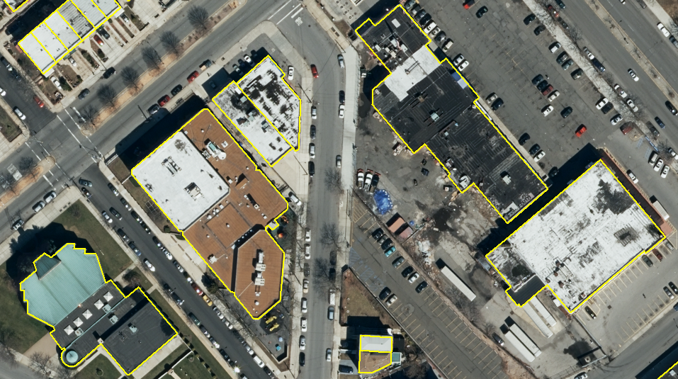
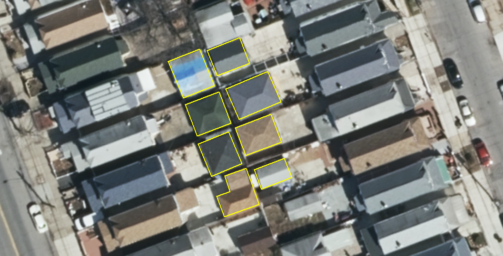
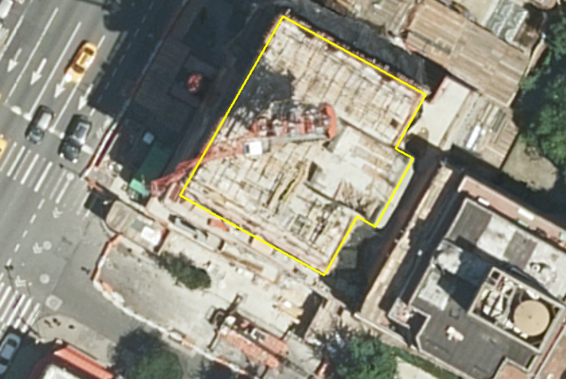
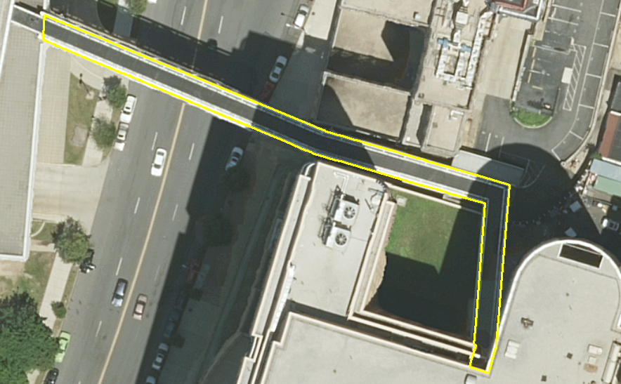
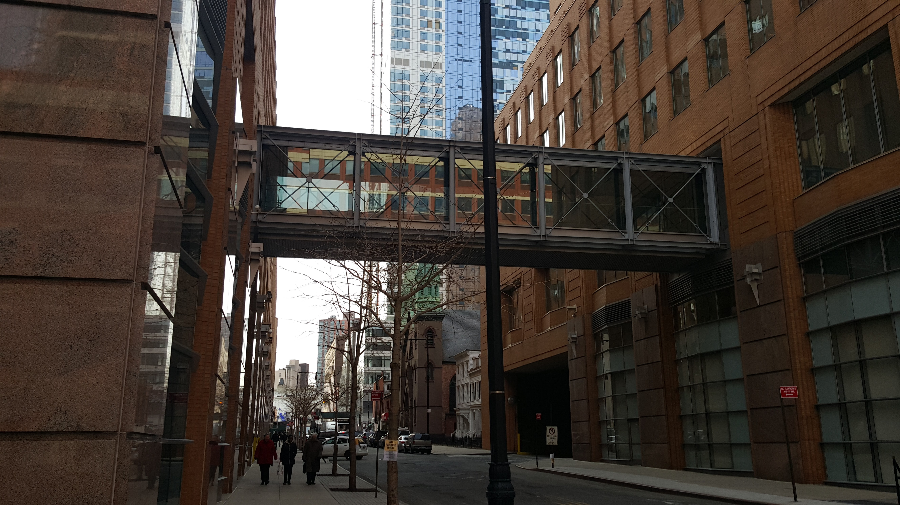
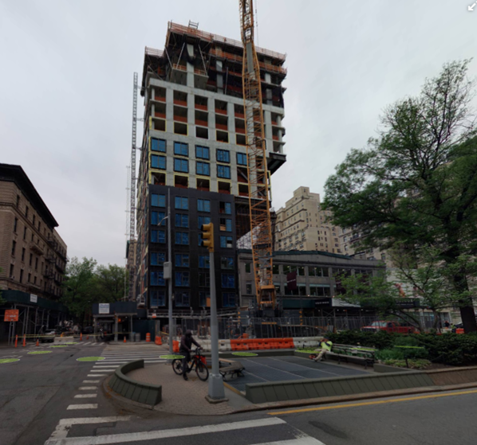
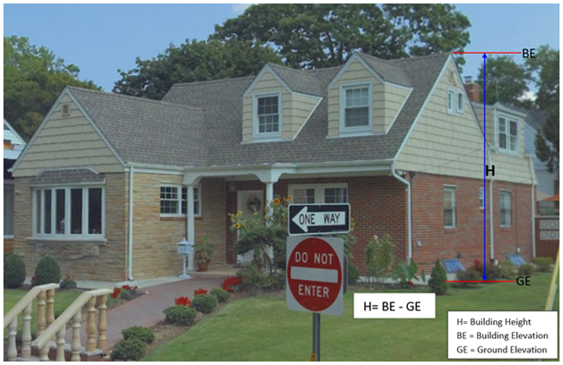
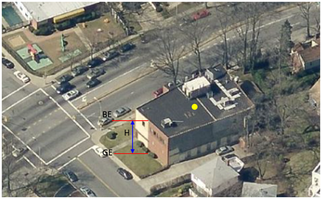

These feature classes are collected in planimetrics for internal use.  The planimetrics feature classes are not published.

See the [nyc-geo-metadata repository](https://github.com/CityOfNewYork/nyc-geo-metadata/tree/main) for published data.

**FEATURE CLASSES**

* [**Building Footprint**](#building-footprint)
* [**Street Centerline**](#street-centerline)

# BUILDING FOOTPRINT

**Geometry Type:** Polygon

|     |     |
| --- | --- |
| **Subtype** | **Feature Code** |
| **[Building](#subtype-building)** | 2100 |
| **[Garage](#subtype-garage)** | 5110 |
| **[Building Under Construction](#subtype-building-uc-building-under-construction)** | 5100 |
| **[Sky Bridge](#subtype-skybridge)** | 2110 |
| **[Cantilevered Building](#subtype-cantilevered-building)** | 1006 |

[**Attributes**](#building-footprint-attributes)

[**Diagrams**](#building-footprint-diagrams)

### Subtype: BUILDING

|     |     |
| --- | --- |
| **Sources** | Current imagery - see intro for specific dates. Buildng footprint database. |
| **Features Captured** | All buildings with well-defined walls and roofs that are >400 square feet and taller than 12 feet were captured. Buildings with <12 feet height but with BIN were captured. Buildings with BIN but <400 square feet were also captured. |
| **Capture Notes** | Buildings with flat roofs were captured on roof outline, capturing the largest outline (excluding overhangs, awnings, construction features, etc.). Buildings with pitched roofs were captured on the building footprint. Carports, when attached to main building, were included in the outline. Interior divisions within buildings were not captured (used existing building layer and BIN as guide). Parcel data and BIN was used as guidance for collection. Where the parcel data indicated that a building should be two or more geometries AND there was NO physical indication, the building was split using the parcel lines. Where the parcel data indicated that a building should be two or more geometries AND there was a physical indication, the building was split using the physical indications. If an existing building was split into several new buildings, the original BIN was retained in only one of the new buildings (ideally the largest) and the new buildings were assigned an "million" BIN (as a placeholder). BINs can not be duplicated. Building Footprints abutting one another on a single tax lot, but each having a unique BIN, were flagged and verified during review. If a building was demolished (i.e., as evidenced in the imagery), the BIN was also deleted and was not used for any new building geometry. Small triangles denote a permit is out to construct a new building at the location.  These small triangles were added by DoITT building editors. These triangles should be removed when new buildings are added. Therefore if a new building was constructed in the new orthos, the building was captured,  the attributes from triangle to building were transferred to the new building, and the triangle was deleted. If no new building was visible on the orthos, the triangles were left in the data. A “million" BIN was assigned to buildings not existing in the source database. For more information regarding BIN, see [Building Footprint Attributes](#building-footprint-attributes). |
| **Features Excluded** | The following features were not captured: •  temporary trailers, tents, or roofs at gas stations (over pumps). • roofs (overhang) to gas stations, unless connected to building. • movable jet bridge for access to aircraft. • awnings, scaffolds, or sidewalk sheds. |
| **Feature View** |  |

### Subtype: GARAGE

|     |     |
| --- | --- |
| **Sources** | Current imagery - see intro for specific dates. Building footprint database.  DOF Digital Tax Map database |
| **Features Captured** | All garages were captured, regardless of size.  To be considered a garage, the structure must have a driveway (paved or unpaved) for road  access, and be able to store one or more cars. |
| **Capture Notes** | Special care was applied to ensure sheds were not confused with garages. In general, standard dimensions for detached garages are approximately 12’x20’ or 14’x20’. The Parcel layer was used to place garages within parcel or at parcel boundary – being sure to check for special cases where parcel boundary clearly crosses a garage. In these cases, either the garage was split using physical features, or the property line was used where there was no distinguishing physical feature. A “million" BIN was assigned to garages not existing in the source database. For more information regarding BIN, see [Building Footprint Attributes](#building-footprint-attributes). |
| **Features Excluded** | Small tool or storage sheds in backyards which have no visible car access were not captured. |
| **Feature View** |  |

### Subtype: BUILDING U/C (Building under Construction)

|     |     |
| --- | --- |
| **Sources** | Current imagery - see intro for specific dates. Building footprint database.  DOF Digital Tax Map database |
| **Features Captured** | Buildings that were under construction in the imagery and had outside walls that clearly indicated the shape of the building were captured. A “million" BIN was assigned to buildings (under construction) not existing in the source database.  For more information regarding BIN, see [Building Footprint Attributes](#building-footprint-attributes). |
| **Capture Notes** | n/a |
| **Features Excluded** | Under construction buildings were not captured when only the foundation was visible or if the building was being destroyed. |
| **Feature View** |  |

### Subtype: SKYBRIDGE

|     |     |
| --- | --- |
| **Sources** | Current imagery - see intro for specific dates.  PLUTO |
| **Features Captured** | Elevated walkways that connect buildings were captured as separate building polygons and coded as “Skybridge”. |
| **Capture Notes** | Skybridges were populated with the “HEIGHT_ROOF” attribute only (not Ground Elevation).These were assigned an “million" BIN during capture (Borough code, 1-5, plus 6 zeros).  For more information regarding BIN, see [Building Footprint Attributes](#building-footprint-attributes). |
| **Features Excluded** | n/a |
| **Feature View** |  |
| **Photo** |  |

### Subtype: CANTILEVERED BUILDING

|     |     |
| --- | --- |
| **Sources** | Current imagery - see intro for specific dates.  Building footprint database. |
| **Features Captured** | This is for buildings where some portion of the footprint overhangs another building footprint, but is not a Skybridge, which is typically narrow and serves solely as an aerial bridge between two structures. |
| **Capture Notes** | This was a new subtype in the 2022 collection.|
| **Features Excluded** | n/a |
| **Feature View** | |
| **Photo** |  |

#### Building Footprint Attributes

|     |     |
| --- | --- |
| **Attribute** | **Description** |
| **NAME** | Name of building. |
| **BIN_NUMBER** | A Building Identification Number (BIN) is a unique identifier assigned by the Department of City Planning (DCP) for buildings in Geosupport. DoITT inserts assigned BINs into their respective footprints on an ongoing basis through interagency coordination. For cases where a BIN has not been assigned or cannot be determined, a "million” BIN is inserted as follows: • 1000000 for Manhattan • 2000000 for Bronx • 3000000 for Brooklyn • 4000000 for Queens • 5000000 for Staten Island |
| **BBL** | Borough-Block-Lot (BBL) or parcel numbers identify the location of buildings or properties |
| **CONSTURCTION_YEAR (CNSTRCT_YR)** | Derived from PLUTO. The year construction of the building was completed. See "BuiltCode" field for details on accuracy. |
| **GEOM_SOURCE (GEOMSOURCE)** | Source for the construction of the building geometry.   |
| **LAST_MODIFY_DATE (LSTMODDATE)** | Date that a building feature's geometry or attributes was last modified. |
| **LAST_STATUS_TYPE (LSTSTATYPE)** | The status of a building - "Constructed", "Marked for Construction", or "Marked for Demolition".  |
| **DOITT_ID** | Unique numeric ID assigned by DoITT.  |
| **HEIGHT_ROOF (HEIGHTROOF)** | Building roof height was calculated as the difference between ground elevation of the building and the roof elevation value.  The roof elevation is the highest point of the roof itself (see [BUILDING ELEVATION](#subtype-building-elevation) in the [ELEVATION](#elevation) Feature Class). See [Building Footprint Diagrams](#building-footprint-diagrams) below for additional details. |
| **GROUND_ELEVATION (GROUNDELEV)** | Represents an interpolated elevation value at the centroid (center point) of the building. The process for capturing this is as follows: 1. A bare-earth surface is generated from the 2010 LiDAR by first removing any points that fall within a building polygon. These points are removed to eliminate any data anomalies (e.g., points captured at the roof level). A Digital Terrain Model (DTM) is then generated from the remaining points by interpolating the elevations around the building edges to develop a continuous surface. 2. Building centroids (i.e., the center point within each building) are then draped over the  DTM generated from step 1.  The bare-earth elevation value at that building centroid is then transferred to the ground elevation attribute of the building footprint.  The purpose is to determine a single elevation value that is representative of the elevation values surrounding each building.  |
| **NUM_FLOORS** | Derived from PLUTO. Indicates the number of full and partial stories starting from the ground floor. For cases where a lot has more than one building, the number of stories in the primary building on the tax lot is applied to all buildings on the lot.|
| **BUILT_CODE** | Derived from PLUTO. A code indicating whether the year the building was built (CONSTRUCTION_YEAR) is an estimate. E = Estimate; Blank = Year Built is not an Estimate |
| **COMMENT** | Comment field- if necessary |

#### Building Footprint Diagrams
##### Calculating HEIGHT_ROOF

# STREET CENTERLINE

**Geometry Type:** Polyline

|     |     |
| --- | --- |
| **Sources** | Current imagery - see intro for specific dates. Latest CSCL.Centerline features in GDB feature class format. SEGMENTID will be used as a key to transfer tabular data updates to the production CSCL.Centerline features. |
| **Features Captured** | These featuers represent street centerlines. |
| **Capture Notes** | CSCL geometry will not be edited; edits made to CSCL (Centerline) will be limited to attributes. As a general rule, no attributes will be assigned to the “generic” or “faux” CSCL centerline segments.  SEGMENT_TYPE NOT IN (‘F’, ‘G’) All other types of segments will get attributes when they have corresponding PavementEdge/Roadbed features. In some cases this will include adding attributes to driveways, alleys, etc If no roadbed exists, these attributes will not be captured. |
| **Features Excluded** |  |
| **Feature View** | |

#### Street Centerline Attributes

|     |     |
| --- | --- |
| **Attribute** | **Description** |
| **SEGMENTID** | SEGMENTID column from CSCL.Centerline will be used as a key so that DoITT can transfer the attribute updates back to the production CSCL database. |
| **L_BLOCKFACEID** | Left Blockface ID will be conflated from the corresponding pavement edge EOPID field. The determination of “left” will be made based on the digitized direction of CSCL rather than any visual “left”. In cases where the CSCL is broken into smaller segments along the blockface, than each of these segments will be assigned the same blockface ID. (see [Pavement Edge](#pavement-edge) for more details on BlockfaceID conflation rules). |
| **R_BLOCKFACEID** | Right Blockface ID will be conflated from the corresponding pavement edge EOPID field. The determination n of “right” will be made based on the digitized direction of CSCL rather than any visual “right”. In cases where the CSCL is broken into smaller segments along the blockface, than each of these segments will be assigned the same blockface ID. (see [Pavement Edge](#pavement-edge) for more details on BlockfaceID conflation rules).|
| **STNAME_LABEL** | The name of the corresponding street. |
| **RW_TYPE** | Type of roadway. |
| **NUMBER_TRAVEL_LANES** | The total number of travel lanes. |
| **NUMBER_PARK_LANES** | The total number of parking lanes. |
| **NUMBER_TOTAL_LANES** | NUMBER_TRAVEL_LANES plus NUMBER_PARK_LANES. |
| **STREETWIDTH_MAX** | The maximum measured street width. |
| **STREETWIDTH_MIN** | The minimum measured street width. |
